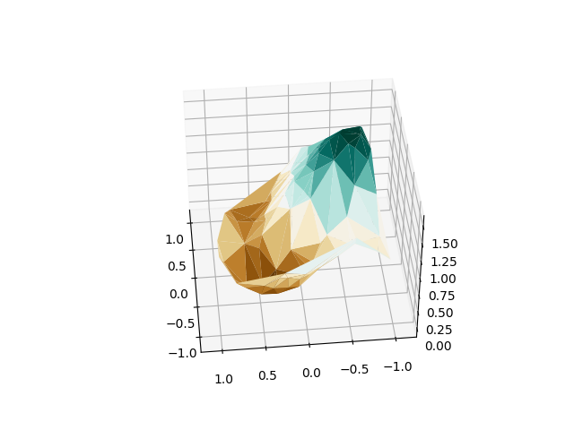
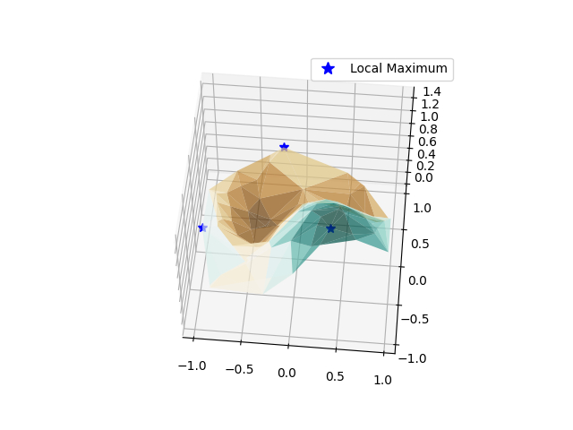
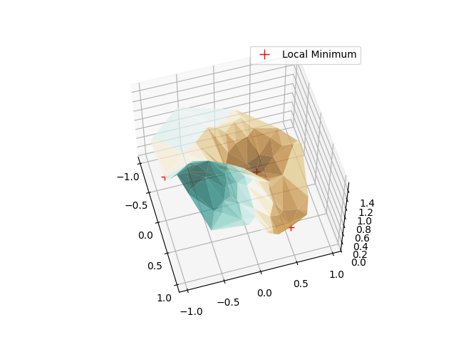
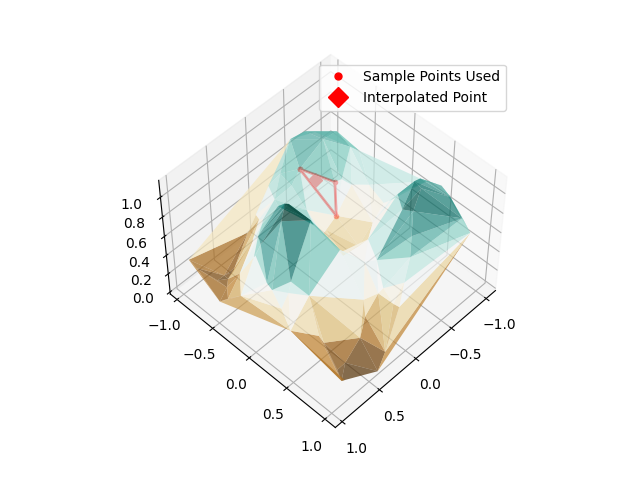
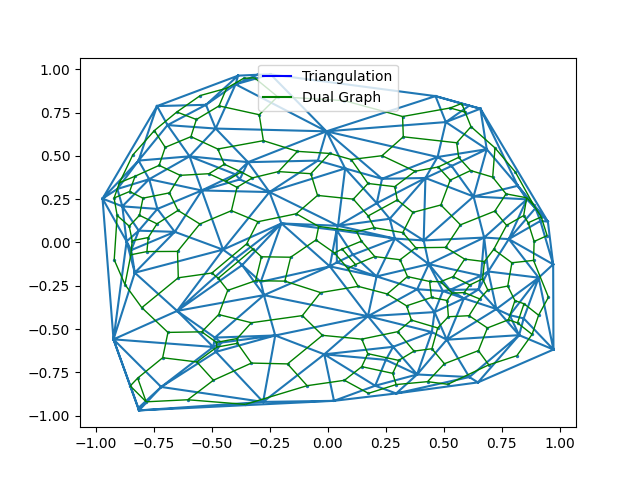

Small TIN (Triangulated Irregular Network) implementation, with the help of scipy Delaunay triangulation.

It gives a nice simple interface for plotting things of interest such as:

The associated surface:

The Local Maximum and Minimum:

Highlighting linear interpolation for points NOT in initial sampled data:

And a visualization of an associated dual graph:

This was done as a homework for my Computational Geometry class. Feel free to use this in anyway that it might be useful.
